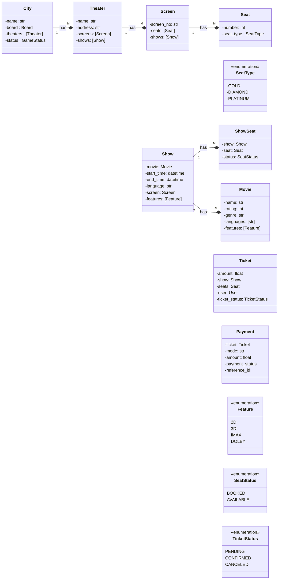

```mermaid
classDiagram
direction RL
class City{
    -name: str
    -board : Board
    -theaters : [Theater]
    -status : GameStatus
}

class Theater{
    -name: str
    -address: str
    -screens: [Screen]
    -shows: [Show]
}

class Screen{
    -screen_no: str
    -seats: [Seat]
    -shows: [Show]
}

class Seat{
    -number: int 
    -seat_type : SeatType 
}

class SeatType{
    <<enumeration>>
    -GOLD
    -DIAMOND
    -PLATINUM
}

class Movie{
    -name: str
    -rating: int 
    -genre: str 
    -languages: [str]
    -features: [Feature] 
}

class Show{
    -movie: Movie
    -start_time: datetime
    -end_time: datetime
    -language: str
    -screen: Screen
    -features: [Feature]
}


class ShowSeat{
    -show: Show
    -seat: Seat
    -status: SeatStatus
}


class Ticket{
    -amount: float 
    -show: Show
    -seats: Seat
    -user: User
    -ticket_status: TicketStatus
}

class Payment{
    -ticket: Ticket
    -mode: str
    -amount: float
    -payment_status
    -reference_id
}


class Feature{
    <<enumeration>>
    2D 
    3D 
    IMAX 
    DOLBY
}

class SeatStatus{
    <<enumeration>>
    BOOKED 
    AVAILABLE
}

class TicketStatus{
    <<enumeration>> 
    PENDING
    CONFIRMED 
    CANCELED
}


Theater "M" *-- "1" City : has
Screen "M" *-- "1" Theater : has
Seat "M" *-- "1" Screen: has
ShowSeat "M" *-- "1" Show : has
Movie "M" *-- "M" Show : has


```
