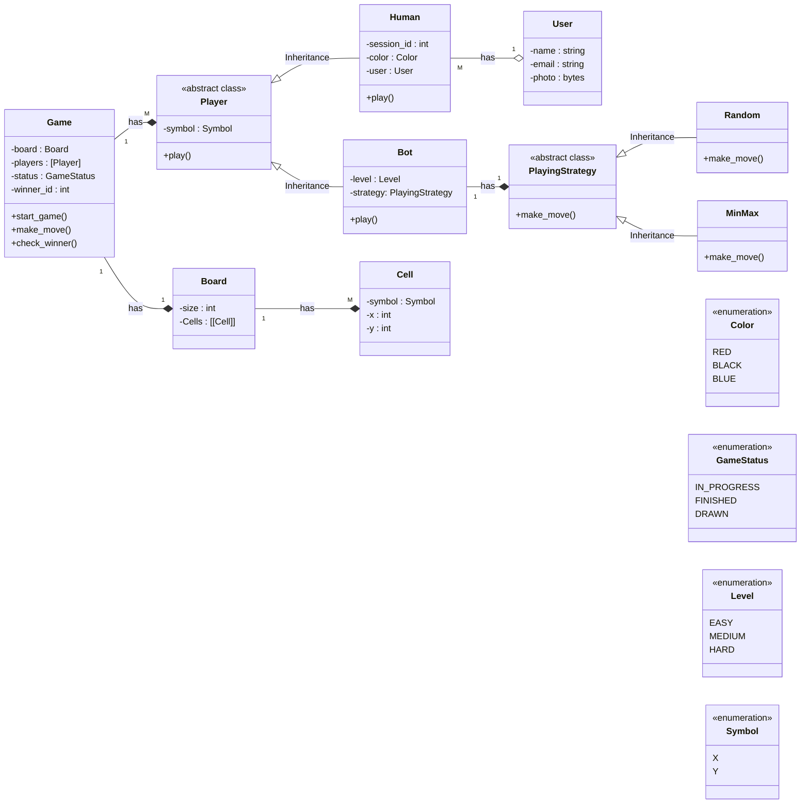

    To solve problem no -4 and -5 we can use Flyweight desing pattern 
    Create 2 classes Intrinsic and Extrinsic 
    1. User(Intrinsic) - This class will not change (name, email, photo)
    2. Human(Extrinsic) - This class will have session_id, color 

