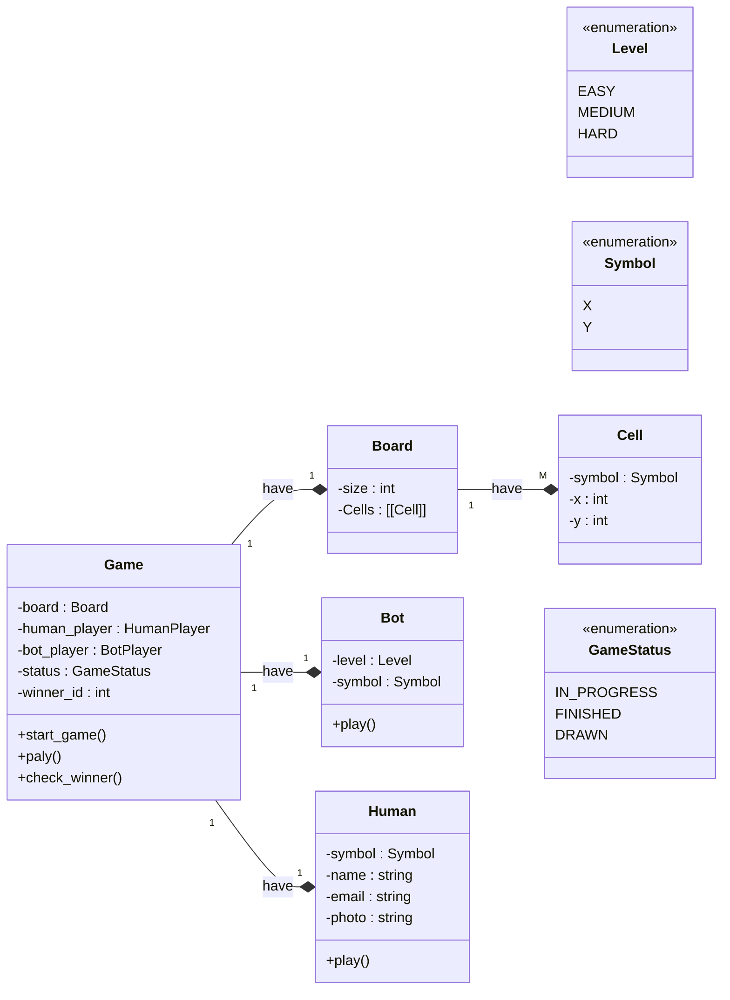

## Class - Game 

# Problems with this initial design
    1. Can we have a Human vs Bot match - True
    2. Can we have 2 Human players match? - False 
    3. Tommarow if we want to have a 3 player game or 4 player game, can we do?  - False 
    4. For every game we will create a new Human object, what if Human wants to play multiple game together? - False
    5. If we are going to create new Human object with every game, Human object creation will be expensive, as if it will have a real image inspite image url 
    

    SOLID PROBLEMS
        Tight Coupling - 
            * Need to change Game class, for 2 Human players match

        Field and Method duplication
            * play() in both classes (Human and bot)
            * symbol in both classes (Human and bot)

        Type wise selection - if else ladder (SRP and OCP violation) 
            * will have to implement play() method level wise 
            * if EASY - do this 
            * if MEDIUM - do this 
            * if HARD - do this 

