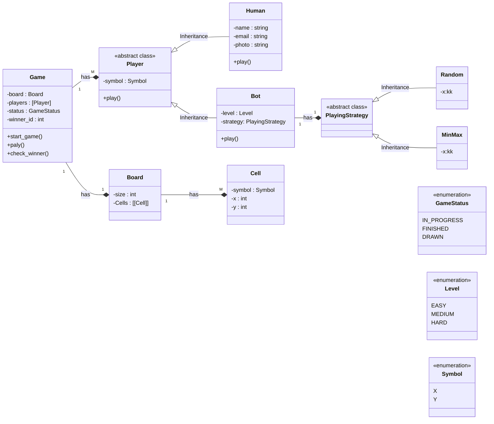

# Problems with this v1 design
    1. Can we have a Human vs Bot match - True
    2. Can we have 2 Human players match? - False 
    3. Tommarow if we want to have a 3 player game or 4 player game, can we do?  - False 
    4. For every game we will create a new Human object, what if Human wants to play multiple game together? - False
    5. If we are going to create new Human object with every game, Human object creation will be expensive, as if it will have a real image inspite image url 
    

    SOLID Problems
        1. Tight Coupling - 
            * Need to change Game class, for 2 Human players match

        2. Field and Method duplication
            * play() in both classes (Human and bot)
            * symbol in both classes (Human and bot)

        3. Type wise selection - if else ladder (SRP and OCP violation) 
            * will have to implement play() method level wise 
            * if EASY - do this 
            * if MEDIUM - do this 
            * if HARD - do this 

# Solution 

Problem No -2 solved\
Problem No -3 solved\
SOLID Problems No -1 solved\
SOLID Problems No -2 solved

-   Associate a list of Player class as players with Game class, so that we can have multiple humane player
-   Remove Bot association from Game as it is a type of Player parent class
-   Create a parent player class

 
 
 
 

    To solve SOLID Problems No -3, easy solution will be to create 3 different child classes Easybot, MediumBot, HardBot and make Bot Parent class.

    Problem with this is that if our EasyBot and MediumBot both using same algo, we will se code duplication

    We should use Strategy Design Pattern here 

    1. Create a PlayingStrategy Abstract class having method play()
    2. Have concrete classes, Random, MinMax
    3. In our context class Bot, add reference to PlayingStrategy

 
 

